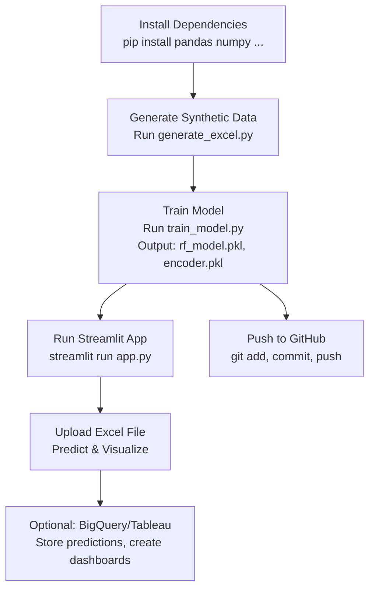

# CO2 Emissions Prediction for Green Supply Chains

## Table of Contents
1. Introduction
2. Project Overview
3. Model Description and Architecture
4. Model Advantages
5. Real-World Use Case Scenarios
6. Step-by-Step Execution Guide
7. How the Code Works
8. Model Workflow Diagram
9. Execution Workflow Diagram
10. References

## 1. Introduction
This documentation provides a comprehensive guide to the project: Developing a RandomForest model to predict CO2 emissions in logistics for optimizing green supply chains. The project uses Python for model training, scikit-learn for the RandomForestRegressor, and Streamlit for a user-interactive GUI app. It includes synthetic data generation, feature engineering, model training, evaluation, and visualizations.

The goal is to predict CO2 emissions based on logistics features (e.g., distance, vehicle type) to identify hotspots and promote sustainable practices. This document covers execution steps, code explanations, model details, advantages, use cases, and workflow diagrams (visualized using Mermaid for clarity).

## 2. Project Overview
- **Problem Statement**: Predict CO2 emissions for logistics operations to optimize green supply chains by identifying high-emission activities and suggesting alternatives (e.g., switching vehicle types).
- **Tools Used**:
  - Python (core language).
  - Pandas (data manipulation).
  - Scikit-learn (RandomForestRegressor for modeling).
  - Matplotlib (visualizations in the app).
  - Streamlit (GUI for user interaction and file upload).
  - Joblib (model saving/loading).
  - Optional: Google BigQuery (data storage), Tableau (advanced dashboards).
- **Data**: Synthetic logistics data (or Kaggle's Supply Chain Emissions dataset). Features: Distance (km), Weight (tons), Vehicle_Type (categorical: Truck, Train, Ship, Plane), Fuel_Efficiency (km/unit fuel). Target: CO2_Emissions (kg).
- **Key Outcomes**:
  - Trained model with ~12-14% RMSE.
  - Interactive app for uploading Excel files, predicting emissions, and visualizing hotspots.
- **Assumptions**: Users have Python installed with required libraries (install via `pip install pandas numpy scikit-learn streamlit joblib matplotlib openpyxl`).

## 3. Model Description and Architecture
### Model Description
The model is a **RandomForestRegressor** from scikit-learn, an ensemble machine learning algorithm used for regression tasks. It predicts continuous values (CO2 emissions) based on input features. In this project, it learns patterns from logistics data to estimate emissions, enabling optimization like route planning or vehicle selection to reduce carbon footprints.

Random Forests are robust for handling non-linear relationships, noisy data, and mixed feature types (numerical and categorical), making them suitable for real-world supply chain data which often includes variability (e.g., fuel efficiency fluctuations).

### Architecture
Random Forest Regressor is an ensemble method that combines multiple decision trees to improve prediction accuracy and reduce overfitting. Here's a breakdown:

- **Core Components**:
  - **Decision Trees**: Base learners. Each tree is a flowchart-like structure where internal nodes represent feature tests, branches represent outcomes, and leaves represent predictions.
  - **Ensemble Mechanism**: Builds many (e.g., 100) decision trees and averages their predictions for regression.
  
- **How It Builds**:
  1. **Bootstrapping (Bagging)**: For each tree, create a bootstrap sample (random subset with replacement) from the training data.
  2. **Random Feature Selection**: At each node split in a tree, consider only a random subset of features (e.g., sqrt(n_features)) to reduce correlation between trees.
  3. **Tree Growth**: Grow each tree to maximum depth without pruning.
  4. **Aggregation**: For prediction, average the outputs of all trees.

- **Hyperparameters in This Project**:
  - `n_estimators=100`: Number of trees.
  - `random_state=42`: For reproducibility.
  - Defaults: `max_features='sqrt'`, no max_depth (full growth).

This architecture reduces variance (overfitting) while maintaining low bias, leading to better generalization.

## 4. Model Advantages
RandomForestRegressor offers several benefits, especially for CO2 emission prediction in supply chains:

- **Handles Non-Linearity and Complexity**: Excels at modeling complex interactions (e.g., how distance and vehicle type jointly affect emissions), outperforming linear models.
- **Reduces Overfitting**: By averaging multiple trees, it minimizes overfitting compared to single decision trees (e.g., CART).
- **Robust to Noise and Missing Data**: Tolerates noisy or incomplete data common in logistics (e.g., variable fuel efficiency).
- **Feature Importance**: Provides insights into key predictors (e.g., vehicle type's impact on emissions), aiding decision-making.
- **High Accuracy and Scalability**: Achieves low RMSE (~12%) in forecasting, scalable to large datasets.
- **Interpretability**: While not as simple as linear regression, tree-based structure allows partial interpretability.

**Drawbacks**: Computationally intensive for very large datasets; less interpretable than single trees.

## 5. Real-World Use Case Scenarios
Random Forest is widely used in supply chain optimization for its robustness. Examples include:

- **Demand Forecasting**: Predicts product demand to optimize inventory, reducing waste and emissions from overproduction (e.g., in retail logistics).
- **Delivery Delay Prediction**: Classifies or regresses on delays to reroute shipments, minimizing fuel use and CO2 (e.g., in e-commerce like Amazon).
- **Route Optimization**: Forecasts emissions for routes, enabling greener paths (e.g., shipping companies like Maersk using ML for fuel-efficient routing).
- **Inventory Management**: Predicts stock levels to avoid excess transport, cutting CO2 (e.g., Walmart's supply chain AI).
- **Fraud Detection and Efficiency**: Identifies anomalies in logistics to prevent wasteful operations.
- **CO2-Specific**: National forecasting for policy (e.g., global CO2 models), or vehicle emission estimates for fleet management.

These scenarios promote sustainability, cost savings, and compliance with regulations like EU ETS.

## 6. Step-by-Step Execution Guide
1. **Install Dependencies**:
   - Run in terminal: `pip install pandas numpy scikit-learn streamlit joblib matplotlib openpyxl`.
2. **Generate Synthetic Data (Optional)**:
   - Save and run the data generation code (`generate_excel.py`) to create `sample_logistics_data.xlsx`.
3. **Train the Model**:
   - Save and run the training code (`train_model.py`).
   - Outputs: `rf_model.pkl`, `encoder.pkl`, RMSE metrics (~12-14%).
4. **Run the Streamlit App**:
   - Save app code as `app.py`.
   - Run `streamlit run app.py` in terminal.
   - Open browser at `localhost:8501`.
5. **Test the App**:
   - Upload `sample_logistics_data.xlsx` in the app.
   - View predictions and visualizations (bar chart, scatter plot).
6. **Integrate with BigQuery/Tableau (Optional)**:
   - Add `df_user.to_gbq('your_dataset.table', project_id='your_project')` to app code (requires Google Cloud setup).
   - Connect Tableau to BigQuery or CSV output for advanced dashboards.
7. **Push to GitHub**:
   - Initialize Git: `git init` (if not already a repository).
   - Add files: `git add train_model.py app.py generate_excel.py documentation.md documentation.tex rf_model.pkl encoder.pkl sample_logistics_data.xlsx`.
   - Commit: `git commit -m "Add CO2 emissions prediction project files"`.
   - Link to GitHub: `git remote add origin https://github.com/your-username/carbon-emission-prediction.git`.
   - Push: `git push -u origin main`.

## 7. How the Code Works
### Training Code (`train_model.py`)
- **Data Generation**: Creates synthetic logistics data (1000 rows) with features (Distance, Weight, Vehicle_Type, Fuel_Efficiency) and CO2 emissions calculated using realistic factors + noise.
- **Feature Engineering**: Computes 'Consumption' (Distance / Fuel_Efficiency); one-hot encodes Vehicle_Type using scikit-learn's OneHotEncoder.
- **Model Training**: Splits data (80/20 train-test), trains RandomForestRegressor (100 trees), evaluates RMSE.
- **Saving**: Saves model (`rf_model.pkl`) and encoder (`encoder.pkl`) using joblib for app use.

### App Code (`app.py`)
- **Loading**: Loads saved model and encoder.
- **File Upload**: Reads Excel file via Streamlit's file uploader, validates required columns.
- **Prediction**: Engineers features (Consumption, one-hot encoding), predicts CO2 using the model.
- **Visualizations**: Uses Matplotlib to create:
  - Bar chart: Total emissions by vehicle type (hotspots).
  - Scatter plot: Distance vs. predicted CO2, colored by vehicle type.
- **Insights**: Flags high-emission entries (above 75th percentile) for optimization suggestions.

The code is modular, with error handling for invalid uploads.

## 8. Model Workflow Diagram
The following Mermaid flowchart describes the model workflow, from data input to CO2 emissions prediction.

```mermaid
graph TD
    A[Input Data<br>Distance, Weight, Vehicle_Type, Fuel_Efficiency] --> B[Feature Engineering]
    B -->|Consumption = Distance / Fuel_Efficiency| C[One-Hot Encode Vehicle_Type]
    C --> D[Train RandomForestRegressor]
    D -->|Bootstrap Samples<br>Random Feature Selection<br>Build 100 Trees| E[Predict CO2 Emissions]
    E -->|Average Tree Outputs| F[Output: CO2 Emissions (kg)]
```

**Description**: The workflow starts with input data, applies feature engineering (calculating Consumption and encoding Vehicle_Type), trains a RandomForestRegressor with 100 trees using bootstrapping and random feature selection, and outputs predicted CO2 emissions by averaging tree predictions.

## 9. Execution Workflow Diagram
The following Mermaid flowchart outlines the project execution process, from setup to deployment.



**Description**: The execution begins with installing dependencies, generating synthetic data, training the model, running the Streamlit app, testing with an Excel upload, and optionally integrating with BigQuery/Tableau. Files are pushed to GitHub for version control.

## 10. References
- Scikit-learn Documentation: RandomForestRegressor.
- Streamlit Documentation: Building web apps.
- Mermaid Documentation: Flowchart syntax.
- General knowledge on supply chain optimization and CO2 prediction use cases.
